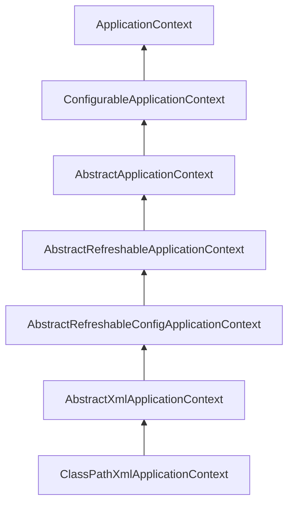

# spring
1.Spring是一个开源的免费的框架（容器）！
2.Spring是一个轻量级的，非入侵式的框架！
3.控制反转（IOC），面向切面编程（AOP）!
4.支持事务的处理，对框架整合的支持！

总结一句话：Spring就是一个轻量级的控制反转（IOC）和面向切面编程（AOP）的框架！

# IOC理论
1.UserDao接口
```java
public interface UserDao {
    void getUser();
}
```
2.UserDaoImpl实现类
```java
public class UserDaoImpl implements UserDao {
    @Override
    public void getUser() {
        System.out.println("默认获取用户的数据！");
    }
}
```
3.UserService接口
```java
public interface UserService {
    void getUser();
}
```
4.UserServiceImpl实现类
```java
public class UserServiceImpl implements UserService{
    private UserDao userDao = new UserDaoImpl();
    @Override
    public void getUser() {
        userDao.getUser();
    }
}
```
5.MyTest
```java
public class MyTest {
    public static void main(String[] args) {
        // 用户实现调用的是业务层，dao层它们不需要接触
        UserServiceImpl userService = new UserServiceImpl();
        userService.getUser();
    }
}
```
这是一个简单的业务的过程，但是现在要添加一个新的UserMysqlImpl实现类
```java
public class UserMysqlImpl implements UserDao{
    @Override
    public void getUser() {
        System.out.println("mysql数据获取！");
    }
}
```
要想要实现，UserServiceImpl实现类也需要修改
```java
public class UserServiceImpl implements UserService{
    private UserDao userDao = new UserMysqlImpl();
    @Override
    public void getUser() {
        userDao.getUser();
    }
}
```

在我们之前的业务中，用户的需求可能会影响我们原来的代码，我们需要根据用户的需求去修改源代码！
如果程序代码量十分大，修改一次的成本代价十分昂贵

我们使用一个Set接口实现,已经发生了革命性的变化！
```java
public class UserServiceImpl implements UserService{
    private UserDao userDao;

    // 利用set进行动态实现值的注入
    public void setUserDao(UserDao userDao) {
        this.userDao = userDao;
    }

    @Override
    public void getUser() {
        userDao.getUser();
    }
}
```
MyTest类
```java
public class MyTest {
    public static void main(String[] args) {
        // 用户实现调用的是业务层，dao层它们不需要接触
        UserServiceImpl userService = new UserServiceImpl();
        userService.setUserDao(new UserMysqlImpl());
        userService.getUser();
    }
}
```

之前，程序是主动创建对象！控制权在程序猿手上！
使用了set注入后，程序不在具有主动性，而是变成了被动的接受对象！
主动权再用户手上。

这种思想，从本质上解决了问题，我们程序猿不用再去管理对象的创建了!
系统的耦合性大大降低，可以更加关注再业务的实现上。这是IOC的原型！

## IOC本质
控制反转IOC（Inversion of Control），是一种设计思想，DI（依赖注入）是实现IOC的一种方法，
也有人认为DI只是IOC的另一种说法。没有IOC的程序，我们使用面向对象编程，对象的创建与对象间
的依赖关系完全硬编码在程序中，对象的创建由程序自己控制，控制反转后将对象的创建转移给第三方，
个人任务所谓控制反转就是：获得依赖对象的方式反转了。

采用XML方式配置Bean的时候，Bean的定义信息和实现分离的，而采用注解的方式可以把两者合为一体，
Bean的定义信息直接以注解的形式定义在实现类中，从而达到了零配置的目的。

控制反转是一种通过描述（XML或注解）并通过第三方生产或获取特定对象的方式。在Spring中实现
控制反转的是IOC容器，其实现方式是依赖注入（Dependency Injection,DI）

## HelloSpring

做个简单的例子体验一下

创建实体类Hello
```java
public class Hello {
    private String name;

    public String getNaem() {
        return name;
    }

    public void setName(String name) {
        this.name = name;
    }

    @Override
    public String toString() {
        return "Hello{" +
                "name='" + name + '\'' +
                '}';
    }
}
```

这里用的是XML文件方式
```java
<?xml version="1.0" encoding="UTF-8" ?>
<beans xmlns="http://www.springframework.org/schema/beans"
       xmlns:xsi="http://www.w3.org/2001/XMLSchema-instance"
       xsi:schemaLocation="http://www.springframework.org/schema/beans
        http://www.springFramework.org/schema/beans/spring-beans.xsd">

<!--    bean就是Java对象，由Spring创建和管理

        类型  变量名  =  new  类型()
        Hello hello = new Hello();

        id  =  变量
        class  =  new的对象
        property  相当于给对象中的属性设置一个值！
-->
    <bean id="hello" class="com.Hello">
        <property name="name" value="Spring"/>
    </bean>

</beans>
```

在创建一个测试类
```java
public class MyTest {

    public static void main(String[] args) {
        // 获取Spring的上下文对象！
        ApplicationContext context = new ClassPathXmlApplicationContext("Beans.xml");
        // 我们的对象现在都正在Soring中的管理了，我们要使用，直接去里面取出来就可以！
        Hello hello = (Hello) context.getBean("hello");
        System.out.println(hello.toString());
    }
}
```

测试一下，最后的输出结果
```java
Hello{name='Spring'}
```

这个过程中Hello是Spring创建的，Hello对象的属性是Spring容器设置的

这个例子的过程就是控制反转：

控制：谁来控制对象的创建，创痛应用程序的对象是由程序本身控制创建的，使用Spring后，
对象是由Spring来创建的

反转：程序本身不创建对象，而变成被动的接收对象

依赖注入：就是利用set方法进行注入的。
```java
 public void setName(String name) {
        this.name = name;
 }
```

IOC是一种编程思想，由主动的编程编程被懂的接收

在MyTest测试类中
```java
ApplicationContext context = new ClassPathXmlApplicationContext("Beans.xml");
```
浅浅看一下ClassPathXmlApplicationContext的底层代码的：


现在，我们彻底不用再程序中改动了，要实现不同的操作，只需要在xml配置文件中进行修改，
所谓IOC,一句话搞定：对象由Spring来创建，管理，装配！


